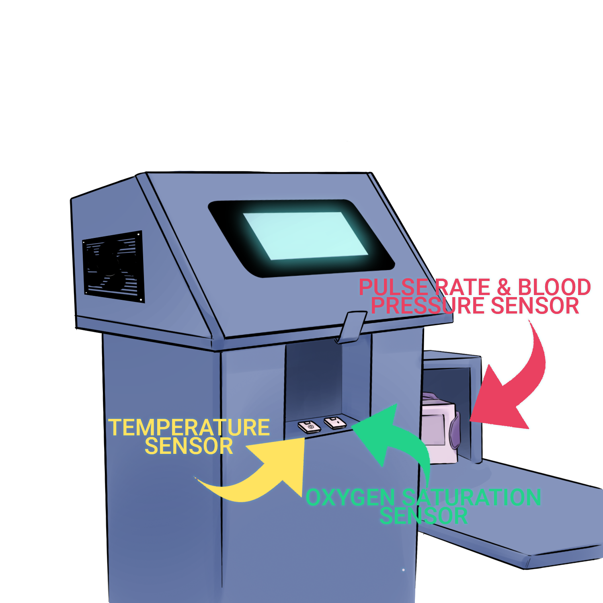
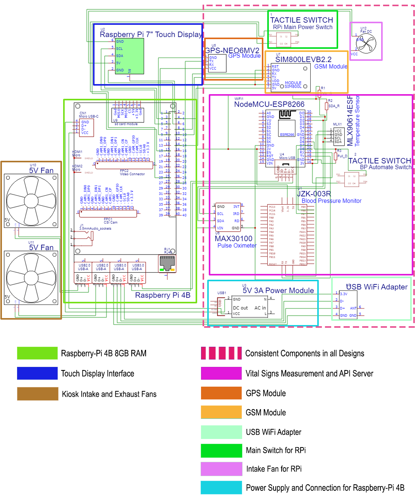

# HIGH GROUNDS HEALTH KIOSK
A self-service health kiosk that performs differential diagnosis and provide recommendations for the user, as well as locate the nearby health facilities.

<br/>

<br/>

## Features
- :bar_chart: **Vital Signs** - Multiple sensors for measuring vital signs.
- :page_with_curl: **Differential Diagnosis** - Multiple sensors for measuring vital signs.
- :beetle: **Disease Information** - Shows disease information including the precautions to take.
- :hospital: **Nearby Facilities** - Locates the nearest facilities where the kiosk is deployed.

## Developers
- Jose Paulo C. Cabral | BS Computer Engineering | Systems Administration  | qjpccabral@tip.edu.ph
- Joshua Albert T. Lopez | BS Computer Engineering | Intelligent Systems  | qjatlopez@tip.edu.ph
- Reinhold E. Lucana | BS Computer Engineering | Systems Administration  | qrelucana@tip.edu.ph
- John Edward Sam T. Matienzo | BS Computer Engineering | Systems Administration  | qjestmatienzo@tip.edu.ph

## Environment
### Prerequisites
- Raspberry Pi 4 (setup according to schematics found in `assets/schematic.png`)
- Chromium web browser
- display drivers (may vary)

### Schematics


### Tested Environment
The code was tested on the official **Raspberry Pi OS 32-bit (bullseye)**.
```
PRETTY_NAME="Raspbian GNU/Linux 11 (bullseye)"
NAME="Raspbian GNU/Linux"
VERSION_ID="11"
VERSION="11 (bullseye)"
VERSION_CODENAME=bullseye
ID=raspbian
ID_LIKE=debian
HOME_URL="http://www.raspbian.org/"
SUPPORT_URL="http://www.raspbian.org/RaspbianForums"
BUG_REPORT_URL="http://www.raspbian.org/RaspbianBugs"
```

## Creating a Development Environment
To run a development environment, simply follow the following steps:
1. Clone the repository on the intended local machine (The instructions will assume that the default pi user is used at the home directory of `/home/pi/`).
    ```
    $ git clone https://github.com/paucabral/health-kiosk.git
    ```
2. Create the respective `.env` files for both the backend and frontend applications. The respective `.env.sample` file for each can be used as a template for the environment variables needed inside each application. In this case, the environment variable set for the sensors endpoint could be a dummy API or the actual sensor endpoint.
3. Afterwards, run the `run-dev.sh` script from a `bash` shell to automate the process of installing the dependencies and running the respective applications. The backend server is a *Django* web application which runs on port `8000` while the frontend server is a *React* web application that runs on port `3000`.
    ```
    $ bash run-dev.sh
    ```

## Deployment in Production
To run the kiosk in production, simply follow the following steps:
1. Prepare the system packages by running the `install.sh` script with superuser privileges.
    ```
    $ sudo bash install.sh
    ```
2. Upload the code located at `nodemcu/nodemcu-sensors.ino` to the NodeMCU (ESP8266).
3. Create the respective `.env` files for both the backend and frontend applications. The respective `.env.sample` file for each can be used as a template for the environment variables needed inside each application.
4. Run the `build.sh` script to build the frontend and backend code.
    ```
    $ bash build.sh
    ```
5. Copy the `health-kiosk.desktop` file inside the autostart directory. This will run the server and launch the *Chromium* web browser in kiosk mode on boot of the desktop environment. 
    ```
    $ sudo cp health-kiosk.desktop /etc/xdg/autostart/health-kiosk.desktop 
    ```
6. For the shutdown button, add the `rpi/rpi_shutdown_script/shutdown.py` script in `/etc/rc.local` above `exit 0` line. Follow the ***highlighted*** line below. 
    <pre>
    <code>
    #!/bin/sh -e
    #
    # rc.local
    #
    # This script is executed at the end of each multiuser runlevel.
    # Make sure that the script will "exit 0" on success or any other
    # value on error.
    #
    # In order to enable or disable this script just change the execution
    # bits.
    #
    # By default this script does nothing.
    
    # Print the IP address
    _IP=$(hostname -I) || true
    if [ "$_IP" ]; then
    printf "My IP address is %s\n" "$_IP"
    fi
    <b><i>sudo python3 /home/pi/health-kiosk/rpi/rpi_shutdown_script/shutdown.py &</i></b>
    exit 0
    </code>
    </pre>
